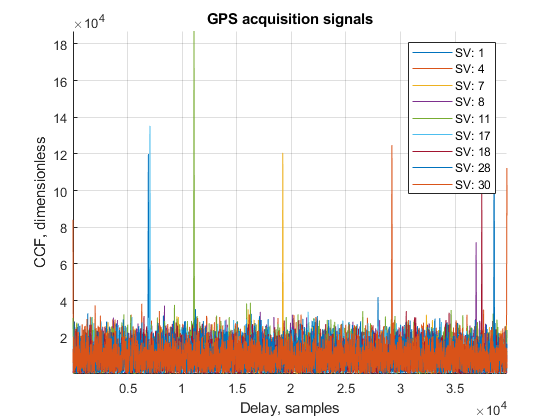

**TL;DR**: There's an excellent new GNSS dataset which would allow you to become a better engineer: [link](http://rnl.ae.utexas.edu/texcup). Beware, it would take some time to download it.

- [TEX-CUP](#tex-cup)
- [GNSS data overview](#gnss-data-overview)
  - [Signal parameters](#signal-parameters)
  - [Signal acquisition](#signal-acquisition)
  - [Signal tracking](#signal-tracking)
  - [Positioning](#positioning)
- [Conclusion](#conclusion)

There is an opinion, that an engineer nowadays should know (at least to some degree) MATLAB, a data scientist should get his hands on the [MNIST](http://yann.lecun.com/exdb/mnist/) handwritten digit database, every FPGA developer should blink a LED and so on. In my opinion, any engineer, related to the GNSS and signal processing should try to perform a signal acquisition to get all the details about the signals. It's a relatively simple task and it's one of the first we give to the interns in our team.

However, there's a problem: due to the extremely high rate of the IF data (ADC samples at the intermediate frequency, which is about 60 MHz for modern high-precision receivers), any file worth investigating would be enormous, mind the fact that it's extremely difficult to collect such data in the first place. 

There are several known existing signal records, but most of them are for basic use only: GPS-only/L1-only, narrowband low-pass filters in the RF front-end etc. They are good to get your hands on the GNSS, but it won't get you far in terms of high-precision or modern receiver design, where multi-band multi-constellation signal processing is important, as well as the sensor fusion with inertial sensors, cameras, radars and so on. 

For example, there's a well-known dataset with GPS L1-only, which you may find useful and it's a (relatively) lightweight signal record, only 1.8G. It's called [GPSdata-DiscreteComponents-fs38_192-if9_55](http://agamenon.tsc.uah.es/Asignaturas/it/rd/apuntes/), it is static (no movement of the receiver), narrowband (as you can see from the power spectrum plot below), about 50 seconds long:

## TEX-CUP

Let's get to the point. About a month ago I've stumbled upon an extremely well-conducted experiment by a team from the University of Texas at Austin Radionavigation Laboratory, which is described in details in the following [article](http://rnl.ae.utexas.edu/images/stories/files/papers/texcup.pdf). 

This team developed a platform called *Sensorium*, which consists of multiple sensors, which are sampled simultaneously and recorded independently. The dataset consists of two identical sub-datasets, taken at two days. Each of the sub-datasets contains the following data:

1. Binary protocol log and the derivative RINEX files from the [Septentrio AsteRx4](https://www.septentrio.com/en/products/gnss-receivers/rover-base-receivers/oem-receiver-boards/asterx4-oem) high-precision receiver;
2. Accelerometer and gyroscope data from the [Bosch BMX055](https://www.bosch-sensortec.com/products/motion-sensors/absolute-orientation-sensors/absolute-orientation-sensors-bmx055.html) IMU;
3. Stereo images from two [Basler acA2040-35gm](https://www.baslerweb.com/en/products/cameras/area-scan-cameras/ace/aca2040-35gm/) cameras with the Sony IMX265 CMOS sensor;
4. Accelerometer and gyroscope data from the [LORD MicroStrain 3DM-GX5-25](https://www.microstrain.com/inertial/3dm-gx5-25) AHRS;
5. Binary IF-data form the [NTLab NT1065-based](http://ntlab.com/section/sec:v:36729.htm) USB3-grabber (dual/triple band);
6. Binary IF-data from the RadioLynx GNSS RF front end;
7. uBlox EVK-M8T NMEA data.

According to the figure of the *Sensorium*, there are RADAR sensors as well, but I've been told that the lab wants to conduct some of the test themselves before making this data public.

As you can see, this is an excellent opportunity for GNSS-related research. One may develop an SDR of various complexity (GPS-only, multi-constellation, multi-frequency etc), sensor fusion with IMU, sensor fusion with cameras and so on. There's even a RINEX data from a separate receiver if you'd like to develop a custom RTK engine!

Due to the fact of the data synchronization, you may develop inertial sensor fusion algorithms on different levels: loose, tight and ultra-tight coupling. As far as I know, this is a first dataset, consisting of both IMU and IF GNSS data, which allow you to develop your ultra-tight coupling algorithms.

## GNSS data overview

Let's take a look at the GNSS data. For this, I'll be using my own WIP software-defined receiver, which I've been working on in my spare time for the last couple of months. It's currently L1-only, GPS+GLONASS (combined). 

### Signal parameters

First, let's take a look at the signal in the L1-band. NT1065 frontend separates the signals to the different sidebands (therefore, GPS L1 and GLONASS L1 are technically independent IF signals), but for the sake of simplicity, I've combined them using the Hilbert transform (Hilbert transform of the real signal provides you with a complex signal with an imaginary part being the real one, shifted 90 degrees).

One more shortcut I've taken is that, because currently, I'm not processing BeiDou signals, I can downsample the signal by the factor of two:

In the upper subplot, you may see the spectrum with the distinctive hump of the NT1065 lowpass filter frequency response at around 1 MHz, as well as the slight elevation in the -14.58 MHz (GPS L1). The central frequency of the mixer is the 1590 MHz, which is typical for most NT1065-based designs.

In the bottom left plot, I've plotted the signal itself, blue being the real and orange — the imaginary parts. To the right, there's a histogram, which looks like a Gaussian distribution, which is what we'd expect from a GNSS signal record. One thing I'd like to point out is the bit depth increment due to the Hilbert transform (the original data was 2-bit).

### Signal acquisition

The next step is the acquisition process. There are several approaches for acquisition, which aren't related to this subject, let me provide the acquisition result plots. 

Bear in mind, that the acquisition is a statistical process and heavily depends on the detection threshold you set. A good acquisition engine also provides additional steps to get the more precise frequency and delay estimation of the signals, as well as the bit and/or overlay code synchronization.

### Signal tracking

After the signals are acquired, the tracker kicks in. In my opinion, it is one of the most scientifically intensive parts of the receiver. Currently, I have a primitive delay- and phase-locked loops, but they do their job, which is fine for me right now.

Tracking results look pretty similar with GLONASS (except for an additional square-wave modulation), therefore let's not provide it here.

### Positioning

As a final step, the receiver decodes the ephemeris data from the tracker output and estimates its position. Currently, due to the time consumption of the receiver, I'm only processing 1 minute of the data (of the about 90 minutes in total). For the first 10 minutes or so the car with the *Sensorium* on top of it just stands still, and then it begins it's movement. 

## Conclusion

Honestly, this dataset is extremely useful for every GNSS-related engineer out there. It's kind of like Large Hadron Collider, where physicists conduct some experiments, record all the data they can, and research it for decades afterwards. I'm really glad I've found it and would like to thank the authors for sharing it with the community. It was a bit of a pain to download it (more than 500GB for the single sub-dataset), but it's worth it. The other thing I'm glad I did just before I've found it is a PC upgrade to 8c/16t CPU, which allowed me to process this data much faster than it would on my old PC.